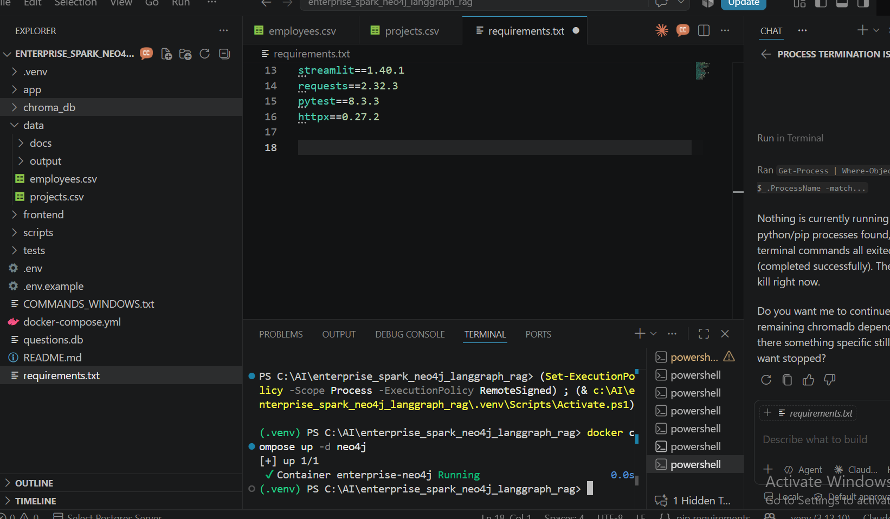
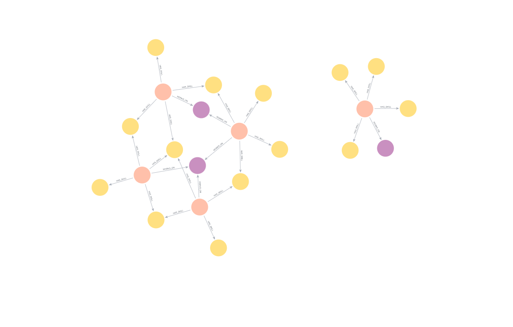

# Enterprise Spark + Neo4j + LangGraph Hybrid RAG

Enterprise-grade **Hybrid GraphRAG** application combining **Apache Spark, Neo4j, LangGraph, vector retrieval, FastAPI, and Streamlit** to deliver grounded answers across structured enterprise relationships and unstructured documents.

<p align="left">
  
  
  
  
  
  
  
</p>

---

## Architecture

```text
              CSV / Enterprise Data              TXT / Enterprise Documents
                       |                                     |
                       v                                     v
                  PySpark ETL                            Embeddings
                       |                                     |
                       v                                     v
            Neo4j Knowledge Graph                    Chroma Vector Store
                       |                                     |
                       +------------------+------------------+
                                          |
                                          v
                              LangGraph Orchestration
                          (route -> retrieve -> generate)
                                          |
                                          v
                                    LLM / RAG Answer
                                          |
                                          v
                                    FastAPI Service
                                          |
                                          v
                                   Streamlit Frontend
```

---

## Key Features

- PySpark ETL pipeline for enterprise data transformation
- Neo4j knowledge graph for employee, project, and skill relationships
- Hybrid retrieval: graph traversal **plus** semantic vector search
- LangGraph workflow orchestration with explicit routing
- Chroma vector database for document embeddings
- OpenAI-compatible LLM and embedding models
- FastAPI REST API with Pydantic validation and Swagger docs
- Streamlit frontend for interactive knowledge discovery
- Source-aware, grounded responses (every answer carries its sources)
- Question history persistence in SQLite
- Dockerized Neo4j deployment with APOC

---

## Knowledge Graph

The ETL job builds relationships such as:

```cypher
(:Employee)-[:HAS_SKILL]->(:Skill)
(:Employee)-[:WORKS_ON]->(:Project)
```

Example GraphRAG question:

> Which employees know Spark and what projects are they working on?

---

## API Endpoints

| Endpoint     | Method | Purpose                              |
| ------------ | ------ | ------------------------------------ |
| `/health`    | GET    | Application and Neo4j health check   |
| `/ingest`    | POST   | Ingest documents into the vector store |
| `/ask`       | POST   | Run a Hybrid GraphRAG query          |
| `/questions` | GET    | View saved question history          |

### Example request

```json
{
  "question": "Which employees know Spark and what projects are they working on?",
  "top_k": 4
}
```

### Example response

```json
{
  "answer": "...",
  "route": "graph+vector",
  "sources": [
    { "source_type": "graph", "source": "neo4j", "content": "..." },
    { "source_type": "vector", "source": "data/docs/project_notes.txt", "content": "..." }
  ]
}
```

---

## Technology Stack

| Layer                | Technologies                                          |
| -------------------- | ----------------------------------------------------- |
| **Data Engineering** | Apache Spark, PySpark, SQL, CSV / Parquet             |
| **Knowledge Graph**  | Neo4j, Cypher, graph retrieval                        |
| **Generative AI**    | LangGraph, LangChain, RAG, GraphRAG, OpenAI, embeddings |
| **Vector Search**    | ChromaDB                                              |
| **Backend**          | Python, FastAPI, Pydantic, Uvicorn                    |
| **Frontend**         | Streamlit                                             |
| **Persistence**      | SQLite                                                |
| **Infrastructure**   | Docker, Docker Compose, Java 17                       |

---

## Local Setup

### 1. Prerequisites

- Python 3.10+
- Java 17 (required by PySpark)
- Docker Desktop

### 2. Environment

```powershell
python -m venv .venv
.\.venv\Scripts\Activate.ps1
pip install -r requirements.txt

Copy-Item .env.example .env
```

Fill in `.env` with your `OPENAI_API_KEY` and Neo4j credentials.

### 3. Start Neo4j

```powershell
docker compose up -d neo4j
```

Neo4j Browser: <http://localhost:7474>

### 4. Run the Spark ETL

```powershell
python scripts\spark_etl_to_neo4j.py
```

### 5. Start FastAPI

```powershell
python -m uvicorn app.main:app --reload --host 127.0.0.1 --port 8000
```

Swagger: <http://127.0.0.1:8000/docs>

### 6. Ingest documents

```powershell
Invoke-RestMethod -Method Post -Uri http://127.0.0.1:8000/ingest
```

### 7. Start Streamlit

```powershell
python -m streamlit run frontend\streamlit_app.py
```

Application: <http://localhost:8501>

> Windows one-shot commands are also available in `COMMANDS_WINDOWS.txt`.

---

## Tests

```powershell
pytest -q
```

---

## Screenshots

| Neo4j Knowledge Graph | Graph Visualisation |
| --- | --- |
|  |  |

| Swagger `/ask` | Swagger `/health` |
| --- | --- |
|  |  |

| Swagger `/ingest` | Swagger `/questions` |
| --- | --- |
|  |  |

---

## Project Highlights

- Designed an end-to-end enterprise GraphRAG architecture.
- Used PySpark to transform structured enterprise datasets at scale.
- Modeled enterprise relationships as a Neo4j property graph.
- Combined semantic vector retrieval with graph-based retrieval for grounded answers.
- Orchestrated retrieval and generation workflows with LangGraph.
- Exposed production-style APIs through FastAPI.
- Built an interactive Streamlit application for enterprise knowledge discovery.

---

## Author

**Girish V** — AI/ML Engineer | Generative AI Engineer | Agentic AI | RAG | LangGraph | MCP

- LinkedIn: <https://www.linkedin.com/in/girish-genai-engineer>
- GitHub: <https://github.com/gireeshvuyyuru501-design>

---

## License

This project is licensed under the [MIT License](LICENSE).
